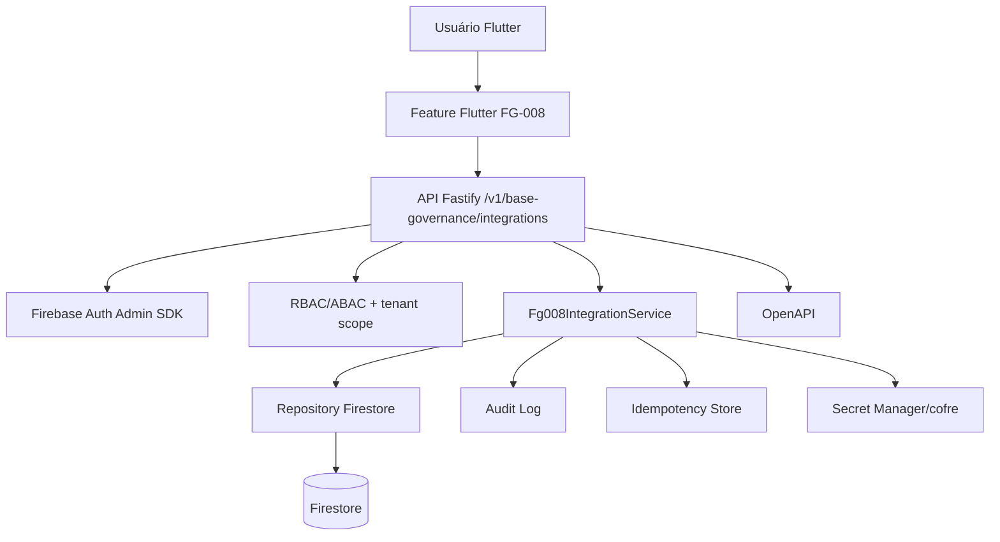
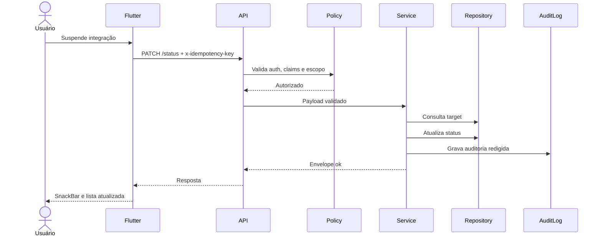

# Documento 02 — UX, Arquitetura e Especificação Técnica — FG-008

## 1. Resumo técnico

A FG-008 implementa a camada de **Integrações, API e webhooks** do módulo Base e Governança, com backend TypeScript, contratos compartilhados, frontend Flutter, regras Firebase e OpenAPI inicial.

A implementação exemplar foi criada em:

```text
/mnt/data/entregas/fg-008-integracoes-api-webhooks/codigo-fonte
```

ZIP gerado:

```text
fg-008-integracoes-api-webhooks_codigo-fonte.zip
```

## 2. Jornada do usuário

1. Usuário autenticado entra em Base e Governança.
2. Seleciona **Integrações, API e webhooks**.
3. Visualiza contexto ativo: tenant, empresa e filial.
4. Busca ou filtra integrações.
5. Consulta API clients e webhooks.
6. Executa ação permitida:
   - criar cliente de API;
   - criar webhook;
   - suspender;
   - reativar;
   - exportar;
   - consultar histórico.
7. Em ação crítica, informa justificativa e confirmação textual.
8. Sistema valida permissões, escopo, payload e idempotência.
9. Sistema registra auditoria e retorna envelope padronizado.
10. UI exibe feedback acessível e atualiza o estado.

## 3. Mapa de telas

| Tela/Rota | Objetivo | Componentes | Estados |
|---|---|---|---|
| `IntegrationsApiWebhooksPage` | Listar e operar integrações | AppBar, banner de contexto, busca, grid/lista, cards, FAB | loading, empty, error, list, forbidden |
| Modal de ação crítica | Suspender/reativar | Texto instrutivo, textarea reason, campo confirmação, cancelar/confirmar | inicial, validação local, enviando, erro, sucesso |
| Detalhe de integração | Consultar configuração e histórico | Header, status chip, abas detalhes/eventos/auditoria | previsto para evolução |
| Formulário cliente API | Criar/editar client | Código, nome, escopos, origens, credential kind, endpoint version | previsto para evolução |
| Formulário webhook | Criar/editar webhook | Código, nome, URL, eventos, retry policy, secret ref | previsto para evolução |

## 4. Wireframes textuais

### Lista mobile

```text
[AppBar: Integrações, API e webhooks] [Atualizar]
[Card contexto: Tenant / Empresa / Filial]
[Campo busca: Código, nome ou descrição]
[Card integração]
  Nome + Status
  Código
  Descrição
  [Detalhes] [Suspender/Reativar]
[FAB: Nova integração]
```

### Lista wide/tablet

```text
[AppBar]
[Contexto operacional]
[Busca e filtros]
[Grid 2 colunas]
  [Card API Client] [Card Webhook]
  [Card API Client] [Card Webhook]
```

### Modal crítico

```text
Título: Suspender integração
Texto: Informe justificativa e digite o ID para confirmar
[Justificativa]
[Confirmação textual]
[Cancelar] [Confirmar]
```

## 5. Componentes e estados da interface

| Componente | Responsabilidade | Acessibilidade |
|---|---|---|
| `_ScopeBanner` | Mostrar contexto tenant/empresa/filial | `Semantics` com label |
| `_IntegrationCard` | Resumo acionável da integração | Label com nome e status |
| `TextField` busca | Busca textual | Label persistente e action search |
| `AlertDialog` crítico | Reason e confirmação | Foco modal e labels |
| `SnackBar` | Feedback não bloqueante | Mensagem curta |
| `CircularProgressIndicator` | Loading | Centralizado |
| Empty state | Ausência de dados | Texto explícito |
| Error state | Falha de API/permissão | Mensagem sem stack trace e botão retry |

## 6. Acessibilidade

- Labels persistentes em campos.
- Feedback de erro próximo à ação.
- Estados não dependem apenas de cor.
- Cards possuem `Semantics`.
- Ação crítica usa diálogo com texto claro.
- Alvos de toque compatíveis com Material 3.
- Mensagens de erro genéricas, sem dados técnicos.

## 7. Responsividade

- Mobile: lista em uma coluna, padding 16.
- Tablet/desktop: grid em duas colunas quando largura ≥ 840, padding 24.
- Busca sempre visível acima dos resultados.
- FAB aparece somente com permissão de gestão.

## 8. Arquitetura





## 9. Modelo de dados

### ApiClient

| Campo | Tipo | Observação |
|---|---|---|
| `id` | string | Gerado no backend |
| `tenantId` | string | Escopo obrigatório |
| `empresaId` | string? | Escopo opcional/condicional |
| `filialId` | string? | Escopo opcional/condicional |
| `code` | string | Único por escopo no projeto real |
| `name` | string | Nome exibido |
| `description` | string? | Até 500 |
| `direction` | enum | inbound/outbound/bidirectional |
| `allowedScopes` | string[] | Escopos lógicos |
| `allowedOrigins` | string[] | HTTPS |
| `endpointVersions` | array | Versionamento de API |
| `credential.secretRef` | string | Referência ao cofre, nunca segredo |
| `status` | enum | active/suspended/archived/pending_review |
| `createdAt/updatedAt` | timestamp | Server-side |
| `createdBy/updatedBy` | string | Actor UID |

### WebhookSubscription

| Campo | Tipo | Observação |
|---|---|---|
| `id` | string | Gerado no backend |
| `tenantId/empresaId/filialId` | string | Escopo |
| `code` | string | Código único por escopo |
| `name` | string | Nome |
| `targetUrl` | string | HTTPS |
| `events` | enum[] | Eventos permitidos |
| `secretRef` | string | Referência ao cofre |
| `retryPolicy` | object | maxAttempts/backoff/deadLetter |
| `status` | enum | active/suspended/archived/pending_review |
| `createdAt/updatedAt` | timestamp | Server-side |

### AuditLog

| Campo | Tipo | Observação |
|---|---|---|
| `actorUid` | string | Firebase UID |
| `action` | string | Ex.: `api_client.created` |
| `targetType/targetId` | string | Recurso alterado |
| `before/after` | object | Redigido |
| `reason` | string | Obrigatório em crítica |
| `requestId` | string | Correlação |
| `idempotencyKey` | string? | Mutações críticas |
| `ip/userAgent` | string? | Observabilidade |
| `createdAt` | timestamp | Server-side |

## 10. Contratos, schemas e DTOs

Arquivo principal:

```text
packages/sharedcontracts/src/v1/base-governance/fg-008.ts
```

Contratos criados:

- `ApiClient`
- `WebhookSubscription`
- `IntegrationAuditEvent`
- `IntegrationEventLog`
- `IntegrationListQuery`
- `CreateApiClientRequest`
- `CreateWebhookSubscriptionRequest`
- `UpdateIntegrationStatusRequest`
- `IntegrationExportRequest`
- `Envelope<T>`
- `FG008_PERMISSION_KEYS`
- validadores server-side sem dependências externas para esta entrega exemplar

Observação: no monorepo real, os validadores podem ser convertidos para Zod mantendo os tipos e mensagens.

## 11. Endpoints/API

| Método | Rota | Permissão | Request | Response | Erros |
|---|---|---|---|---|---|
| GET | `/v1/base-governance/integrations` | `read` | query tenant/empresa/filial/status/search/limit | `Envelope<IntegrationListResponse>` | 401/403/400 |
| GET | `/v1/base-governance/integrations/:targetType/:targetId` | `read` | params + scope | `Envelope<ApiClient|Webhook>` | 401/403/404 |
| POST | `/v1/base-governance/integrations/api-clients` | `create` | `CreateApiClientRequest` + idempotency | `Envelope<ApiClient>` | 400/403/409 |
| POST | `/v1/base-governance/integrations/webhooks` | `create` | `CreateWebhookSubscriptionRequest` + idempotency | `Envelope<WebhookSubscription>` | 400/403/409 |
| PATCH | `/v1/base-governance/integrations/status` | `suspend/reactivate/archive` | `UpdateIntegrationStatusRequest` + idempotency | `Envelope<ApiClient|Webhook>` | 400/403/404/409 |
| POST | `/v1/base-governance/integrations/export` | `export` | `IntegrationExportRequest` + idempotency | `Envelope<rows>` | 400/403/409 |
| GET | `/v1/base-governance/integrations/history` | `history` | scope + targetId opcional | `Envelope<AuditEvent[]>` | 401/403 |

## 12. Segurança, auditoria e observabilidade

- Autenticação obrigatória por Bearer token no repositório real.
- `AuthContext` modela `uid`, `tenantId`, `roleKeys`, `permissionKeys`, `moduleKeys`, `empresaIds`, `filialIds` e `mfaVerified`.
- Autorização server-side em `policy.ts`.
- Tenant isolation em `assertTenantScope`.
- Mutações críticas com idempotência em `idempotency.ts`.
- Auditoria em `audit.ts` com redaction.
- Mascaramento em `redaction.ts`.
- Firestore/Storage deny by default.
- `requestId` propagado no envelope.
- Logs devem excluir tokens, API keys, CPF/CNPJ, e-mail, telefone e payload sensível.
- Rate limit pendente de middleware no repositório real.
- Recomenda-se métrica por status code, tenant, endpoint, latency, retries e idempotency conflicts.

## 13. Retenção

| Dado | Retenção sugerida | Observação |
|---|---:|---|
| Idempotency key | 24h | Evitar replay indefinido |
| Audit logs | 5 anos ou política corporativa | Validar jurídico |
| Payload bruto | TTL curto, mínimo necessário | Evitar PII em logs |
| Exportações | Não persistir conteúdo por padrão | Registrar metadados |
| Credenciais | Secret Manager/cofre | Rotação periódica |

## 14. Backend

### Estrutura

```text
backend/apinode/src/modules/base-governance/fg-008/
  audit.ts
  idempotency.ts
  policy.ts
  redaction.ts
  repository.ts
  routes.ts
  service.ts
  types.ts
```

### Serviços

`Fg008IntegrationService` implementa:

- `list`
- `detail`
- `createApiClient`
- `createWebhook`
- `changeStatus`
- `export`
- `history`

### Repositórios

`InMemoryIntegrationRepository` foi criado para validação local. No repositório real, substituir por Firestore usando as coleções:

```text
/tenants/{tenantId}/integrationApiClients/{id}
/tenants/{tenantId}/webhookSubscriptions/{id}
/tenants/{tenantId}/integrationEventLogs/{id}
/tenants/{tenantId}/auditLogs/{id}
/tenants/{tenantId}/idempotencyKeys/{key}
```

### Controllers/handlers

`registerFg008IntegrationRoutes` recebe uma interface compatível com Fastify (`get`, `post`, `patch`) e registra as rotas.

### Policies/autorização

Permissões:

```text
base_governance.integrations_api_webhooks.read
base_governance.integrations_api_webhooks.create
base_governance.integrations_api_webhooks.update
base_governance.integrations_api_webhooks.suspend
base_governance.integrations_api_webhooks.reactivate
base_governance.integrations_api_webhooks.archive
base_governance.integrations_api_webhooks.export
base_governance.integrations_api_webhooks.history
```

## 15. Frontend

### Estrutura

```text
apps/mobileflutter/lib/features/integrations_api_webhooks/
  application/integrations_controller.dart
  data/integrations_api.dart
  data/integrations_repository.dart
  models/integration_models.dart
  presentation/integrations_page.dart
```

### Páginas/components/widgets

- `IntegrationsApiWebhooksPage`
- `_ScopeBanner`
- `_IntegrationCard`
- modal de ação crítica

### Estado

`IntegrationsState` controla:

- escopo ativo;
- loading;
- lista;
- busca;
- erro;
- permissão de gestão.

### Serviços/API

`IntegrationsApi` encapsula chamadas HTTP:

- listagem;
- alteração de status;
- exportação.

### Formulários

Ação crítica exige:

- reason com mínimo de 10 caracteres;
- confirmação textual igual ao ID do alvo;
- idempotency key.

### Tratamento de erro

`IntegrationsApiException` mantém `code` e mensagem genérica. UI não exibe stack trace.

## 16. Firebase

Arquivos:

```text
firebase/rules/firestore.rules
firebase/rules/storage.rules
firebase/firestore.indexes.json
```

Decisão: leitura limitada por permissão e escopo; escrita direta negada para forçar mutações pela API auditável.

## 17. Plano técnico de implementação

| Ordem | Ação | Arquivos | Critério de pronto |
|---:|---|---|---|
| 1 | Criar contratos compartilhados | `packages/sharedcontracts/.../fg-008.ts` | Typecheck OK |
| 2 | Criar policy, redaction, audit e idempotency | `backend/.../policy.ts`, `redaction.ts`, `audit.ts`, `idempotency.ts` | Testes de autorização/idempotência OK |
| 3 | Criar service/repository/routes | `service.ts`, `repository.ts`, `routes.ts` | Teste local OK |
| 4 | Criar UI Flutter | `apps/mobileflutter/...` | Código criado; Flutter test pendente |
| 5 | Criar regras Firebase e índices | `firebase/rules/*`, `firestore.indexes.json` | Manifest OK |
| 6 | Criar OpenAPI | `openapi/fg-008-integrations.openapi.yaml` | Arquivo presente |
| 7 | Validar | npm scripts | Todos os scripts Node OK |

## 18. Estrutura de arquivos do ZIP

```text
codigo-fonte/
  .gitignore
  README.md
  apps/mobileflutter/lib/features/integrations_api_webhooks/application/integrations_controller.dart
  apps/mobileflutter/lib/features/integrations_api_webhooks/data/integrations_api.dart
  apps/mobileflutter/lib/features/integrations_api_webhooks/data/integrations_repository.dart
  apps/mobileflutter/lib/features/integrations_api_webhooks/models/integration_models.dart
  apps/mobileflutter/lib/features/integrations_api_webhooks/presentation/integrations_page.dart
  apps/mobileflutter/test/features/integrations_api_webhooks/integrations_page_test.dart
  backend/apinode/src/modules/base-governance/fg-008/audit.ts
  backend/apinode/src/modules/base-governance/fg-008/idempotency.ts
  backend/apinode/src/modules/base-governance/fg-008/policy.ts
  backend/apinode/src/modules/base-governance/fg-008/redaction.ts
  backend/apinode/src/modules/base-governance/fg-008/repository.ts
  backend/apinode/src/modules/base-governance/fg-008/routes.ts
  backend/apinode/src/modules/base-governance/fg-008/service.ts
  backend/apinode/src/modules/base-governance/fg-008/types.ts
  backend/apinode/src/modules/base-governance/index.ts
  firebase/firestore.indexes.json
  firebase/rules/firestore.rules
  firebase/rules/storage.rules
  openapi/fg-008-integrations.openapi.yaml
  package.json
  packages/sharedcontracts/src/index.ts
  packages/sharedcontracts/src/v1/base-governance/fg-008.ts
  packages/sharedcontracts/src/v1/base-governance/index.ts
  scripts/validate_manifest.mjs
  tests/fg008.validation.test.cjs
  tsconfig.json
```

## 19. Estratégia de rollback

- Remover registro das rotas FG-008 no bootstrap Fastify.
- Ocultar rota/tela Flutter no GoRouter/menu.
- Reverter rules/indexes Firebase aplicados.
- Desabilitar permissions keys da FG-008.
- Manter audit logs imutáveis; não remover evidências.
- Se houver alteração de schema real, aplicar migration reversa validada.

## 20. Checklist de implementação

| Item | Status |
|---|---|
| Contratos criados | OK |
| Backend modular criado | OK |
| UI Flutter criada | OK |
| OpenAPI criada | OK |
| Regras Firebase criadas | OK |
| Testes Node criados | OK |
| Typecheck executado | OK |
| Build executado | OK |
| Flutter test executado | Pendente por ambiente |
| DPO/Jurídico validou LGPD | Pendente |
| Segurança validou rate limit/MFA/retenção | Pendente |
