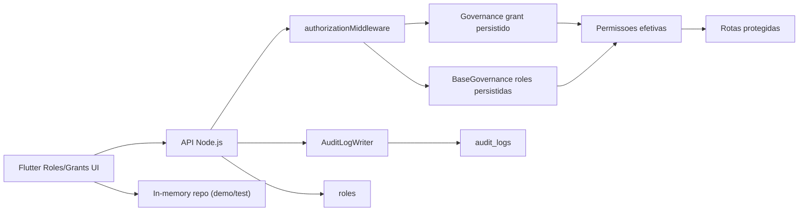

# FG-003 - Arquitetura e Modelagem

## Visao geral

## Modelo logico
- `Role`
  - herda RBAC base
  - agrega escopos por empresa, filial e centro de custo
- `UserScopeGrant`
  - referencia `roleKeys`
  - adiciona `permissionOverrides`
  - define escopo operacional por empresa/filial
- `AuditEvent`
  - documenta alteracoes sensiveis com correlacao entre request e entidade

## Estrategia de autorizacao
- Camada 1: claims do token Firebase
- Camada 2: grant persistido do usuario
- Camada 3: roles persistidas e ativas
- Resultado: `Set<string>` efetivo, avaliado no middleware por permissao-alvo

## Decisao arquitetural
- RBAC foi mantido como mecanismo principal de administracao.
- Elementos de ABAC foram introduzidos por escopo (`tenant`, empresa, filial, centro de custo parametrico).
- ReBAC/owner-based foi apenas preparado conceitualmente; nao foi generalizado em todos os modulos.

## Trade-offs
- Usar `roles` como colecao raiz simplifica consulta administrativa e auditoria cruzada.
- Manter grant fora da claim reduz tamanho do token e permite mudancas sem reemissao completa de identidade.
- Como compensacao, algumas telas precisam recomputar permissao efetiva localmente para UX mais fiel.
